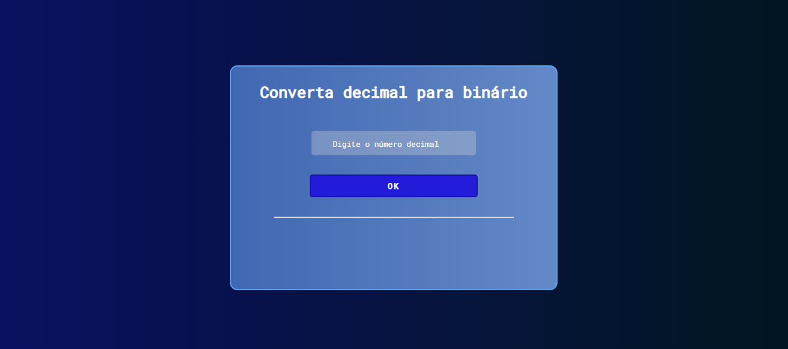

 
  

  &#xa0;

  <!-- <a href="https://dectobin.netlify.app">Demo</a> -->

<h1 align="center">DecToBin</h1>

  

  

  

  

  <!--  -->

  <!--  -->

  <!--  -->

<!-- Status -->

<!-- <h4 align="center"> 
	🚧  DecToBin 🚀 Under construction...  🚧
</h4> 

 -->

  

 

## :dart: About ##

Conversor Decimal to Binary

<a href="#top">Back to top</a>
